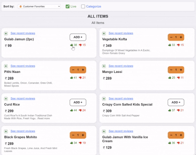
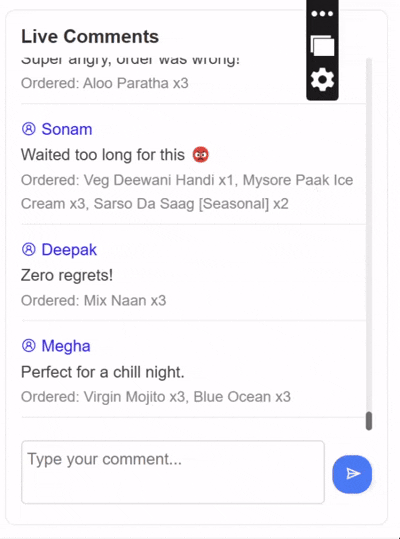
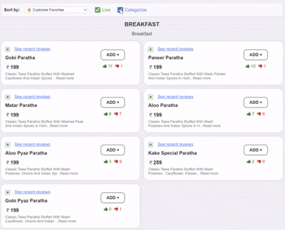

# Kake Di Hatti Clone – Level Up: Vibe Coding Hackathon Submission

This project was created for the [**Level Up: Vibe Coding Hackathon**](https://lu.ma/6xqkxrzh?locale=en-GB&tk=3ZCOyF).

---

## 💡 About the Hackathon

Ever used a website and thought, “This could be so much better?”  
Now’s your chance to prove it.

The Level Up: Vibe Coding Hackathon challenges you to take the sites you use every day — and build the features you have always wanted.

Bring your boldest ideas to life, and build smarter, sharper experiences — all through your code.

### 🚀 How to enter

1. Pick any real-world website you like  
2. Think of a way to make it better — a smarter feature, a new workflow, or improved usability  
3. Build your upgraded version — using any tech stack  
4. Submit your project with a live link + GitHub repo  

### 🧪 Judging criteria

- **🎯 Visual Accuracy:** Fonts, colors, layout matching exactly  
- **✅ Completeness:** Every icon/button present, nothing missing visually  
- **⚙️ Functionality:** All interactive elements work as expected  
- **✨ New Enhancement:** The more complex your addition is the higher score you will get!

---

## 📝 Project Overview

I have cloned the following site:  
[https://kakedihatti.com/order/kake-di-hatti-banasankari-bangalore](https://kakedihatti.com/order/kake-di-hatti-banasankari-bangalore)

because this was the only restaurant/cafetaria's public menu site i could find :)

It is a typical restaurant site that displays a menu and allows users to search, add items to the cart, and more. All core features have been perfectly cloned.

---

## 🌐 Live Demo

Check out the live improved app here:  
[https://this-is-nb.github.io/restaurant-Live-Rating/](https://this-is-nb.github.io/restaurant-Live-Rating/)

---

## ✨ New Features Added

Inspired by the experience of daily food ordering in cafeterias, hostel messes, and the now-discontinued Zomato Everyday, I wanted to solve a real problem: **How do you know what’s actually good today?**  
Menus change daily, and what was tasty yesterday might not be great today. Most food ordering sites don’t help you decide what’s best right now, and reviews are often outdated or generic.

### Why These Features?  

- **Real-time feedback:** In places where the menu changes every day, users often have no idea which dish is worth ordering. Static reviews or ratings don’t help because yesterday’s “best” dish might be today’s flop.
- **Social proof for today:** By surfacing only today’s likes/dislikes and reviews, users get a live pulse on what’s actually good right now.
- **Fun & interactive:** Food ordering should be social and engaging, not just transactional. Live chat and reactions make the experience more lively and trustworthy.

### How These Features Help Users

- **Like/Dislike System:**  
  Users can instantly react to what they just ate. This helps others see at a glance which dishes are hits or misses today, not last week. I belive this is a much better and simpler rating system than 5 stars, as it is much easier to rate and judge.

- **Customer Favorites Sorting:**  
  A new "Customer Favorites" filter uses a weighted Wilson score to sort items by real popularity, factoring in both likes and dislikes. This helps users quickly find the most reliable options.



- **Simulated Live Activity:**  
  Since there’s no backend, the app simulates 50 users who periodically like/dislike and review random food items. This gives a realistic preview of how the live features would feel in a real-world, high-traffic environment.

- **Live Chatbox & Reviews:**  
  Users can leave quick reviews for the items they ordered, and see what others are saying right now. Each food item displays only recent reviews for *today*, so you always know what’s trending and what to avoid.



- **Price Sorting:**  
  Users can sort menu items by price, making it easier to find something within their budget.

- **Live Features Toggle:**  
  Users can turn live features (likes/dislikes and chat) on or off, giving them control over their experience.

- **Categorize/Decategorize Toggle:**  
  Users can switch between a categorized menu or a flat list, depending on how they prefer to browse.




---

### 🚀 The Story Behind These Features

In cafeterias, hostel messes, or cloud kitchens, you often have no clue what’s actually good today.  
By adding live reactions and reviews, users can make smarter, more confident choices, avoid disappointment, and even have fun interacting with the menu and other diners.  
This transforms food ordering from a guessing game into a social, dynamic, and trustworthy experience.

## 🌐 Live Demo

Check out the live improved app here:  
[https://this-is-nb.github.io/restaurant-Live-Rating/](https://this-is-nb.github.io/restaurant-Live-Rating/)

---


## 🛠️ Tech Stack

- React (bootstrapped with Create React App)
- TypeScript
- No backend – all data is simulated in the frontend

---

## 🚀 How to Run

```bash
npm install
npm start
```

Open [http://localhost:3000](http://localhost:3000) to view it in the browser.

---

## 📸 Screenshots

*(Add screenshots here if desired)*

---

## 📢 Notes

- All reviews and likes/dislikes are reset daily (simulated).
- No backend or database is used; all data is in-memory and simulated.

---

## 🙌 Thanks for checking out my hackathon submission!